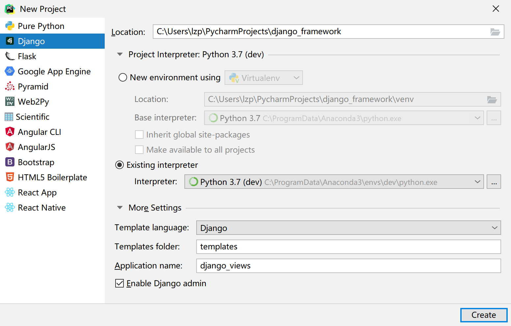
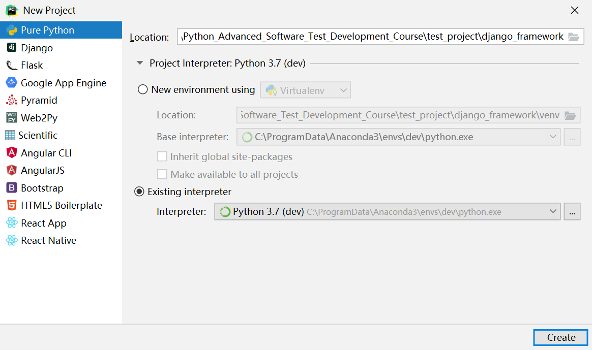
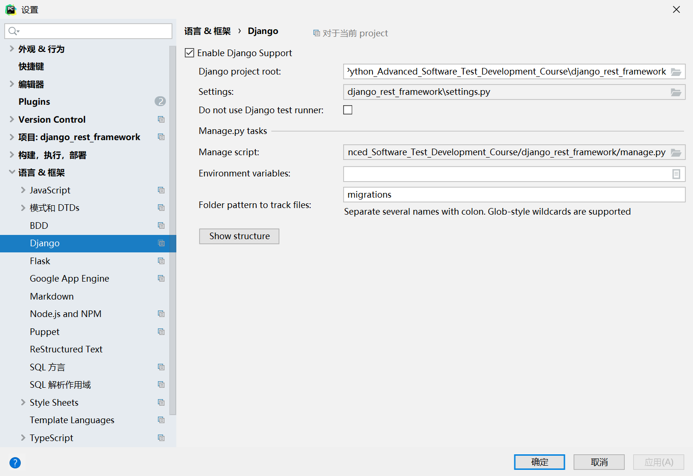
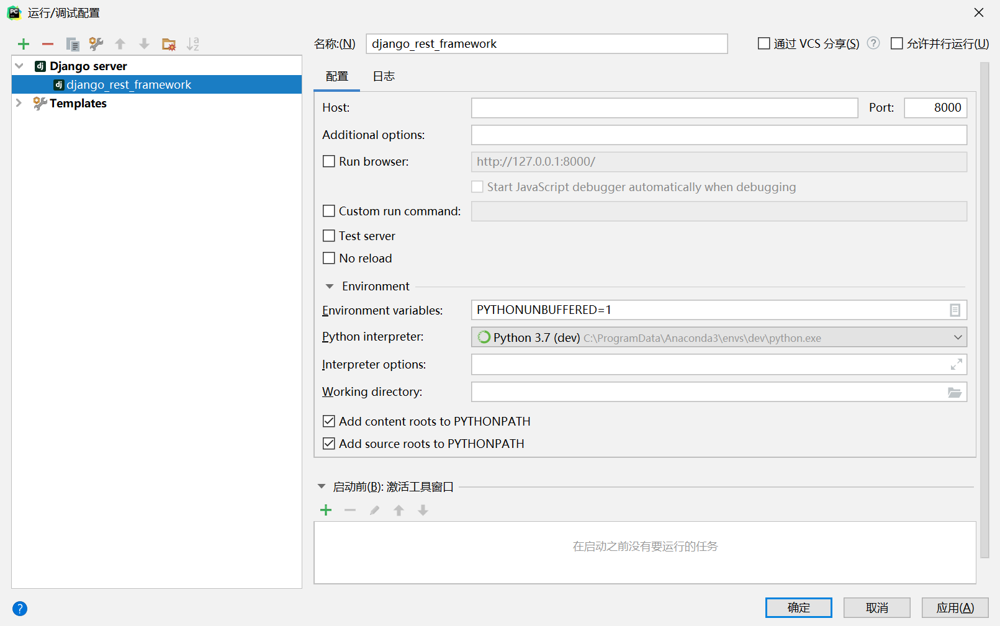
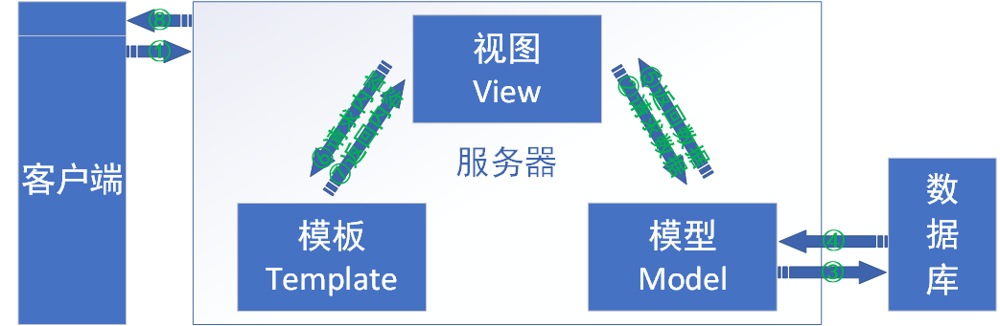

### 目录

##### 一、Django

##### 1、简介

- 为什么要使用框架来开发？

##### 2、Django VS Flask

##### 3、Django是什么？

##### 4、特点

- 提供创建项目工程自动化工具
- 数据库ORM支持
- 模板
- 表单
- Admin管理站点
- 文件管理
- 认证权限
- session机制
- 缓存

##### 二、创建工程

##### 1、创建虚拟环境

##### 2、安装Django

##### 3、创建项目

##### 4、运行项目

##### 5、项目结构

##### 6、修改默认时区

##### 三、创建子应用

##### 1、定义

##### 2、创建

##### 3、注册

##### 4、创建视图

##### 5、添加路由

##### 6、子应用结构


##### 五、路由

###### 1、简介

###### 2、主路由

###### 3、子路由

##### 六、视图

###### 1、定义

###### 2、分类

##### 七、MVT模式和两种开发模式

###### 1、介绍

###### 2、两种开发模式

##### 八、请求与响应

###### 1、请求参数类型

###### 2、响应

##### 九、ORM框架

###### 1、定义

###### 2、步骤

###### 3、初探

###### 4、数据库模型解析

###### 5、admin站点

##### 十、数据库操作

###### 1、简介

###### 2、演练数据库表相关操作

###### 3、c（Create）

###### 4、r（retrieve）

###### 5、u（update）

###### 6、d（delete）

### 一、搭建Django环境

##### 1.安装Python环境

- 使用Anaconda安装虚拟环境

##### 2.安装Django环境

- 使用Anconda在对应虚拟环境中安装Django

##### 3.创建Django项目

- 使用PyCharm专业版新建Django项目

  - 新建项目>>选择Django>>Location填写项目名称>>Project Interpreter选择Existing interpreter（选择虚拟环境）>>Interpreter选择Anconda配置的虚拟环境 >>Application name填写应用名称>>勾选Enable Django admin>>点击Create创建项目。如图：

    

- 使用PyCharm社区版+命令行创建Django项目

  - 新建项目>>Pure Python>>Location填写项目名称>>Project Interpreter选择Existing interpreter（选择虚拟环境）>>Interpreter选择Anconda配置的虚拟环境 >>点击Create创建项目。如图：

    

  - 使用Terminal终端输入命令进行创建Django项目

    ```python
    django-admin startproject django_framework .
    ```

##### 4.Django项目结构介绍

- django_rest_framework项目名

- django_rest_framework二级目录与项目名相同，存放Django相关配置文件

- django_rest_framework/asgi.py是异步服务器相关配置(2.3.0新增模块)

- django_rest_framework/__init__.py包的标志性文件init

- django_rest_framework/settings.py存放Django全局配置信息

- django_rest_framework/urls.py存放全局路由表

- django_rest_framework/wsgi.py在部署Django项目时，使用wsgi服务器配置信息

- db.sqlite3是Django默认使用的sqlite文本数据库

- manage.py是Django提供的命令行操作工具，开发阶段使用它来启动项目和数据库的迁移等等

##### 5.运行Django项目

- 使用PyCharm运行按钮运行Django项目

  - 配置Django项目环境：文件>>设置>>语言&框架>>Django>>勾选Enable Django Support>>Django project root填写项目根目录>>Settings填写项目全局配置文件settings.py>>Manage script填写manage.py脚本管理文件>>点击确认配置

    

  - 配置Django运行脚本：点击Add Configurations>>添加配置>>Django Server>>名称填写项目名称>>Python interpreter选择对应Python虚拟环境>>点击确认

    

  - 点击运行按钮运行Django项目

    

- 使用命令行运行Django项目

  - 直接运行项目

    ```python
    python manage.py runserver
    ```

  - 指定IP和端口运行项目

    ```python
    #指定ip和端口，ip为当前服务器的地址
    python manage.py runserver 10.16.32.31:8888
    python manage.py runserver localhost：8888
    
    #指定端口
    python manage.py runserver 端口
    ```

- 停止运行Django项目

  - 直接关闭命令行窗口终止服务器
  - Terminal终端输入命令Ctrl+C终止服务器

##### 6.修改Django环境配置

- 设置语言和时区

  ```python
  # 编辑全局配置文件settings.py
  
  LANGUAGE_CODE = 'zh-hans'  # 设置语言为中文
  TIME_ZONE = 'Asia/Shanghai'  # 设置时区为亚洲/上海
  ```

- 取消Csr安全配置

  ```python
  MIDDLEWARE = [
      # 'django.middleware.csrf.CsrfViewMiddleware',
  ]
  ```

### 二、创建一个功能

##### 1.创建子应用

- 有两种方法实现创建应用

  - 使用PyCharm专业版，在创建工程时选择Django并输入子应用名称>>勾选Enable Django admin
- 使用命令行创建
  
```python
# name为子应用名称
python manage.py startapp name
```

##### 2.子应用意义

- 是Django最小的功能模块，会以应用的形式呈现
- 方便重用
- 结构更加清晰

##### 3.子应用结构

- django_views/migrations存放数据库迁移的相关信息
- django_views/__init__.py包的标志性文件init
- django_views/admin.py为admin站点的配置信息
- django_views/apps.py存放app的标签等相关信息
- django_views/models.py存放数据库模型相关信息
- django_views/tests.py存放当前应用的单元测试相关信息
- django_views/views.py主要定义相关功能（业务逻辑）

##### 4.全局配置文件中添加子应用信息

- 在settings.py全局配置文件中的INSTALLED_APPS列表中添加app的信息

  ```python
  # django_views为应用名称，DjangoViewsConfig首字母大写
  INSTALLED_APPS = [
      'django_views.apps.DjangoViewsConfig',
  ]
  ```

##### 5.编写子应用相关功能

- 在django_views/views.py中创建相关功能（函数视图或者类视图）

  ```python
  from django.http import HttpResponse
  
  # 函数视图
  def index(request):  
      return HttpResponse("<h1>可优村长你好啊！</h1>")
  ```
  
- 函数视图一定包含两个对象

  - request>>HttpRequest对象，用户请求相关的信息
  - HttpResponse>>响应字符串
  - 对于HttpRequest请求对象来说，是由django自动创建的，但是HttpResponse响应对象就必须我们自己创建。每个view请求处理方法必须返回一个HttpResponse响应对象。HttpResponse类需要在django.http.HttpResponse中导入。
  - 视图函数默认支持所有请求方法：get、post、put、delete等
  - 可以使用request.method来区分不同请求返回不同内容
  
  ```python
  from django.http import HttpResponse
  from django.views import View
  
  # 类视图,同时需要导入View
  class HomeIndex(View):
      def get(self,request):
          return HttpResponse("<h1>可优村长你好啊！</h1>")
  ```
  
- 类视图的优点:

  - 代码可读性好

  - 类视图相对于函数视图有更高的复用性,如果其他地方需要使用到某个类的某个特定方法,直接继承该类的视图就可以了

  - 实例方法get、post、put、delete全部小写与相应的请求方法一一对应

  - get实例方法第一个参数为当前类视图的对象，第二个参数为HttpRequest请求对象
  
  - 每个实例方法必须返回HttpResponse对象或者HttpResponse子类对象
  
  - 定义类视图需要继承自的Django提供的父类的View或者View子类
  
    ```python
    from django.views import View
    ```
  
- render函数的第一个参数为HttpRequest对象，第二个参数为静态文件模板，第三个参数locals()当前实例方法的本地变量
  类方法

##### 6.路由表中添加路由信息

-   全局路由和子路由的作用：

    -   使views里面处理数据的函数与请求的**url**建立映射关系。
    -   发起请求后，根据**urls.py**里的关系条目，去查找与请求对应的处理方法，从而返回给客户端。

-   路由匹配规则：

    -   发起请求后，使用请求路径去匹配**urls.py**中**urlpatterns**列表的值，**urlpatterns**为固定名称的列表

    -   **urlpatterns**列表中的元素分别代表一条路由信息

        -   第一个参数index/代表的是请求路径
        -   第二个参数index为子应用中views模块的视图名称

        ```python
        urlpatterns = [
            path('admin/', admin.site.urls),
            path('index/', index),
        ]
        ```

    -   函数视图、类视图和子路由可以作为**urlpatterns**的元素，

           - 函数视图作为元素：直接使用函数名作为path的第二个参数

          ```python
        path('index/', index)
          ```

           - 类视图作为元素：使用**类方法名.as_view()**作为path的第二个参数

          ``` python
        path('index/', HomeIndex.as_view())
          ```

           - 子路由作为元素：如果path函数的第二个参数为**include**，则进入**include**的参数对应元素的子路由中进行匹配，子路由匹配规则与全局路由相同
                - 需要导入django.urls中的include模块
             - django_views/为子应用目录，include参数为**'子应用名称.urls'**的字符串

          ```python
        from django.urls import include
        path('django_views/',include('django_views.urls'))
          ```

     - 全局路由和子路由在客户端访问时，全局路由可直接访问对应路径子应用的函数视图或者类视图，子路由需要先访问子应用目录后访问对应路径子应用的函数视图或类视图

     -   从往下匹配与请求路径对应的元素

          -   元素中包含请求路径的关键字，即匹配上，**Django**会自动调用**path**函数的第二个参数指定的视图（函数视图或者类视图）并停止匹配
          -   元素中不包含请求路径的关键字，即未匹配上，则抛出404异常（默认返回为404页面，状态码为404）

- 全局路由表django_rest_framework/urls.py中添加路由信息，即urlpatterns添加元素。
  
  *简意：一步到位*
  
     ```python
  from django.contrib import admin
  from django.urls import path, include
  
  # from django_views.views import index
  # from django_views.views import HomeIndex
  
  urlpatterns = [
      path('admin/', admin.site.urls),
      # 函数视图的全局路由配置
      # path('index/', index),
  
      # 类视图的全局路由配置
      #  path('index/', HomeIndex.as_view()),
  
      # 子路由的全局路由配置
      path('django_views/', include('django_views.urls')),
  ]
     ```
  
   - 具体方法见“路由匹配规则”C中的类视图作为元素
   - 在全局路由中添加子路由信息     #先匹配全局路由，匹配上后进入子路由再次匹配具体路由信息
     - 在django_views中创建urls.py路由文件
       - 在django_views/urls.py配置路由信息   #需导入子应用views.py模块的视图名称，from .views import HomeIndex 具体规则与全局路由一致
     - 在全局路由中添加子路由元素参数include

### 三、MVT模式和两种开发模式

##### 1、[MVT]()模式



- 介绍
  - M全拼为Model，与MVC中的M功能相同，负责和数据库交互，进行数据处理，数据库模型
  - V全拼为View，与MVC中的C功能相同，接收请求，进行业务处理，返回响应
  - T全拼为Template，与MVC中的V功能相同，负责构造要返回的HTML页面

##### 2、两种开发模式

- 前后台不分离：后端控制数据的展示，前端与后端的耦合度很高，返回的是HTML页面，实用性、拓展性差，只能用于浏览器，其他终端不适配。
- 前后端分离：后端仅返回前端所需要的数据，不再控制前端的展示效果。前端的展示效果全由前端负责，前后端完全独立，耦合度相对较低。
  - 前后端可同时开发，缩小业务上线周期。
  - 适用性、拓展性非常好
  - 适合多终端运行同一套接口（PC、APP、小程序等）

### 四、请求、响应和模式类定义

##### 1、请求参数类型

- 前端向后端的传参方式

  - 查询字符串传参

    - 格式：url?xx=aa&yy=bb

  - 请求体传参

    - form表单：x-www-form-urlencoded
    - json数据格式：{"x":1,"y":2}
    - 上传文件

  - 路径传参

    - url路径中的参数

      - 命名参数
      - 未命名参数

    - 路径格式：url/pk/

    - 路由格式：

      ```python
      urlpatterns = [
          path('admin/', admin.site.urls),
          path('HomeIndex/<int:pk>/', HomeIndex.as_view())
      ]
      ```

    - 视图格式：

      ```python
      def post(self, request,pk):
          print(pk)
          return HttpResponse("<h1>这个是POST方法请求的返回结果</h1>")
      ```

  - 请求头传参

    - 在headers中填入键值对

- 后端接收方式

  - 查询字符串：使用request.GET对返回QueryDict对象（伪字典）的属性进行获取，可以通过QueryDict的[]、get()和getlist()方法来获取对应的数据。

    - []与字典功能一致，填入键可获取值
    - get()用来获取请求参数中只有单个key的数据
    - getlist()用来获取请求参数中有重复key的数据

  - 请求体传参

    - from表单：使用request.POST对返回的QueryDict对象的属性进行获取可以通过QueryDict的[]、get()和getlist()方法来获取对应的数据。
      - []与字典功能一致，填入键可获取值
      - get()用来获取请求参数中只有单个key的数据
      - getlist()用来获取请求参数中有重复key的数据

  - json数据格式：使用request.body获取返回的bytes类型数据，并使用decode('utf-8')将字节类型解码转换成字符串。然后倒入json模块，将字符串装换成字典。

    ```python
    import json
    from django.http import HttpResponse
    from django.views import View
    
    class HomeIndex(View):
        def post(self, request):
            print(json.loads(request.body.decode('utf-8')))
            return HttpResponse("<h1>这个是POST方法请求的返回结果</h1>")
    
    ```

    

  - 上传文件：使用request.FILES获取文件数据

  - 路径传参：在路由中定义路径参数，格式：/<ini:pk>/，路径参数类型转换器包含int、slug、uuid等，在代码中直接调用pk获取传参，如果匹配不上直接返回404页面

  - 请求头传参：使用request.META对返回的dict进行取值。

    - []填入键可获得值

    - get()填入键获得值

    - 键格式：'HTTP_AOPSID'，HTTP_作为前缀，_请求头参数key大写

    - ```python
      request.META.get('HTTP_AOPSID')
      ```

##### 2、响应

- 视图中必须返回HttpResponse对象或者子对象

- HttpResponse(content=响应体，content_type=响应体数据类型，status=状态码)

  - HttpResponse第一个参数content为响应体（字符串）
  - 第二个参数Content-Type，指定响应数据格式
  - 第三个参数status为响应状态码，默认为200

- jsonRespone

  -  JsonResponse第一个参数data，默认情况只能传递字典类型的数据

  - 如果第一个参数为费字典类型，那么需要指定safe=False

    ```python
    def get(self, request, pk):
        data = {
            'name': 'daodao',
            'age': '18',
            'gender': '男'
        }
        return JsonResponse(data, safe=False)
    ```

##### 2、定义Projects模型类

- 什么是模型类？
  - 怎么定义模型类

### 五、ORM框架

##### 1、定义

- 把类和对象进行映射
- 通过类和对象就能操作它所对应表格中的数据（CRUD）

##### 2、步骤

- 配置数据库连接信息
  - 创建数据库和用户
    
    - 尽量使用工具
    - 少使用代码
    
    ```mysql
    CREATE DATABASE `django` CHARACTER SET 'utf8' COLLATE 'utf8_general_ci';
    # GRANT ALL PRIVILEGES ON *.* TO 'daodao'@'%' IDENTIFIED BY '123456';
    CREATE USER `daodao`@`localhost` IDENTIFIED WITH mysql_native_password BY '123456';
    
    GRANT Alter, Alter Routine, Create, Create Routine, Create Temporary Tables, Create User, Create View, Delete, Drop, Event, Execute, File, Grant Option, Index, Insert, Lock Tables, Process, References, Reload, Replication Client, Replication Slave, Select, Show Databases, Show View, Shutdown, Super, Trigger, Update ON *.* TO `daodao`@`localhost`;
    
    flush privileges;
    
    ```
    
  - Django配置数据库信息
  
    - 需要配置多个数据库，只需要添加一个雷瑟default格式的键值对，值为字典。
  
    ```python
    DATABASES = {
        'default': {
            # 'ENGINE': 'django.db.backends.sqlite3', # Django默认的数据库为sqlite3
            'ENGINE': 'django.db.backends.mysql',  # 数据库引擎
            'NAME': 'django',  # 数据库名
            'USER': 'root',  # 数据库用户名
            'PASSWORD': '123456',  # 数据库密码
            'HOST': 'localhost',  # 数据库主机域名或者IP
            'PORT': 3306  # 数据库端口
        }
    }
    ```
  
  - PyCharm安装mysqlclient
  
    - 尽量使用PyCharm安装
  
    - 使用命令安装及相关依赖
  
      ```python
      #Debian /Ubuntu
      sudo apt-get install python-dev default-libmysqlclient-dev
      #Red Hat /CentOS
      sudo yum install python-devel mysql-devel
      #macOS(Homebrew)
      brew install mysql-client
      #安装mysqlclient
      pip install mysqlclient
      ```
  
    - 在models.py中定义模型类
  
      - 嵌套Meta类可以更改表明
    
      ```python
      from django.db import models
      
      
      # Create your models here.
      #创建模型类表
      class Person(models.Model):
          first_name = models.CharField(max_length=30)
          last_name = models.CharField(max_length=30)
          class Meta:
              # 可以在Meta中使用db_table自定义表名
              db_table = "django_views_TestTeams"
              verbose_name = "测试团队"
      ```
    
    - 迁移
    
      - 对应python环境中运行迁移命令
    
      ```python
      python manage.py makemigrations # 准备迁移数据
      python manage.py migrate # 迁移数据
      ```
    
      
    
    - 通过类和对象操作完成数据库增删改查操作
    
      - 导入数据
  
  3、初探
  
  ```python
  self.name = name
  self.verbose_name = verbose_name  # 属性名
  self._verbose_name = verbose_name  # Store original for deconstruction
  self.primary_key = primary_key	# 主键名
  self.max_length, self._unique = max_length, unique # 最大长度
  self.blank, self.null = blank, null # bank允许不传值，null允许该字段为空
  self.remote_field = rel # 远程字段
  self.is_relation = self.remote_field is not None # 是关系
  self.default = default	# 默认
  self.editable = editable # 可编辑的
  self.serialize = serialize # 连载
  self.unique_for_date = unique_for_date # 唯一的日期
  self.unique_for_month = unique_for_month # 唯一的月份
  self.unique_for_year = unique_for_year	#唯一的年份
  if isinstance(choices, collections.abc.Iterator):
  choices = list(choices)
  self.choices = choices or []
  self.help_text = help_text	# 描述文本
  self.db_index = db_index # 表的索引
  self.db_column = db_column # 表的列 
  self._db_tablespace = db_tablespace	# 表的课哦克难攻坚
  self.auto_created = auto_created # 自动创建
  ```
  
  
  
  - 在projects/models.py中定义Model
  - 迁移
  - ORM的作用
    - 以后不再写SQL语句
      - 生成规范的SQL，可防止SQL注入
  
  ###### 4、数据库模型解析
  
  - 创建interfaces应用
  
  ###### 5、admin站点
  
  - 创建管理员用户
    - python manage.py createsuperuser

### 十、数据库操作

###### 1、简介

- Django提供了一套抽象的API，让我们对数据库表进行CRUD（create,retrivev,update and delete objects）操作
- 简化对数据库的操作

###### 2、演练数据库表相关操作

- 可以使用Shell

  ```python
  # 安装ipython
  pip install -9 https://pypi.douban.com/simple ipython
  python manage.py shell -i ipython
  #查看所有项目
  Projects.objects.all()
  ```

- 打开数据库日志记录

  - %PROGRAMDATA%\MySQL Server x.x\my.ini

  ```python
  #General and show logging.
  log-output=FILE
  general-log=1
  general_log_file="mysql_keyou.log"
  ```

  - 重启之后生效

###### 3、c（Create）

*一个模型类相当于一个表（table）*

*一个模型类对象相当于一条数据（record）*

- 使用模型内构造方法

  ```python
  class IndexView(View):
      def get(self, request):
          one_project = Projects(name="国产大飞机", leader="xxx院士", tester="所见", programmer="龙的传人",
                                 publish_app="国产大飞机C919应用", desc="项目简介")
          # 调用模型类对象save()才能执行sql语句
          one_project.save()
          return HttpResponse("创建项目成功")
  ```

- 使用create

  ```python
  class IndexView(View):
      def get(self, request):
          one_project = Projects.objects.create(name="国产大飞机3", leader="xxx院士", tester="所见", programmer="龙的传人",
                                                publish_app="国产大飞机C919应用", desc="项目简介")
          Interfaces.objects.create(name="国产大飞机C919登录接口", tester="Addoil", project=one_project)
          # Interfaces.objects.create(name="国产大飞机C919登录接口", tester="Addoil", project_id=17)
          return HttpResponse("创建项目成功")
  ```

###### 4、r（retrieve）

- 获取一个数据表的所有记录

  - 返回所有记录组成的模型对象集合（queryset查询集）
  - 获取一张表中的所有记录
    - 调用all()方法，返回QuerySet对象
    - QuerySet对象相当于一个高性能的列表（惰性加载）,QuerySet对象中存放的是模型类对象
    - 支持列表的数字索引功能（返回的是一个模型类对象）、切片操作（返回的依然是一个QuerySet对象）、不支持负值查询
    - QuerySet对象.first()可以获取第一个元素，QuerySet对象.last()获取最后一个元素

  ```python
  class IndexView(View):
      def get(self, request):
          qs = Projects.objects.all()
          for i in qs:
              print(i.name)
          return HttpResponse("查询项目成功")
  ```

- 获取指定记录

  - get()获取某个指定的记录
    - 如果没有查询到记录会报错，如果查询到多个记录也会报错，只有返回一条记录才不会报错
    - 返回的是模型类对象
    - get方法最好使用主键或者唯一键去查询

  ```python
  class IndexView(View):
      def get(self, request):
          qs = Projects.objects.get(id=1)
          return HttpResponse("查询项目成功")
  ```

  - filter()获取多条记录

  ```python
  class IndexView(View):
      def get(self, request):
          qs = Projects.objects.filter(id=1)
          qs = Projects.objects.filter(leader__contains="某人")  # 一条数据的某字段中包含xx内容
          qs = Projects.objects.filter(name__in=["项目1", "项目2"])  # 查看分别在集合中对应的项目
          return HttpResponse("查询项目成功")
  ```

  - exclude

###### 5、u（update）

- 查询模型类对象进行修改对应的数据性值

  - 先获取需要更新的模型类对象
  - 然后修改相关属性
  - 对修改的属性进行保存
  - 一般用在单条数据的修改更新

  ```python
  class IndexView(View):
      def get(self, request):
          one_project = Projects.objects.get(id=19)
          one_project.leader = "龙的传人"
          one_project.save()
          return HttpResponse("修改项目成功")
  ```

- 先使用filter进行过滤，然后使用Upadate对数据进行更新

  - 一般用在批量数据的修改更新

  ```python
  class IndexView(View):
      def get(self, request):
      	Projects.objects.filter(id=16).update(leader="可优院士")
          return HttpResponse("修改项目成功")
  ```

###### 6、d（delete）

- 使用delete方法删除已查询的对象

  ```python
  class IndexView(View):
      def get(self, request):
      	Projects.objects.filter(id=16).update(leader="可优院士")
          return HttpResponse("修改项目成功")
  ```

  