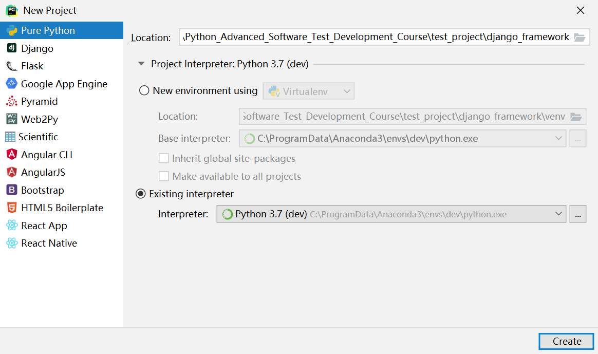
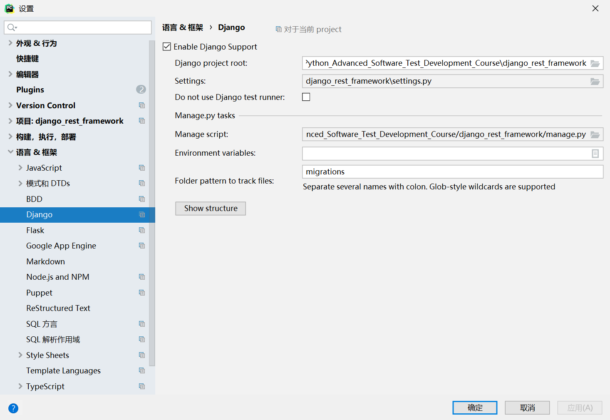
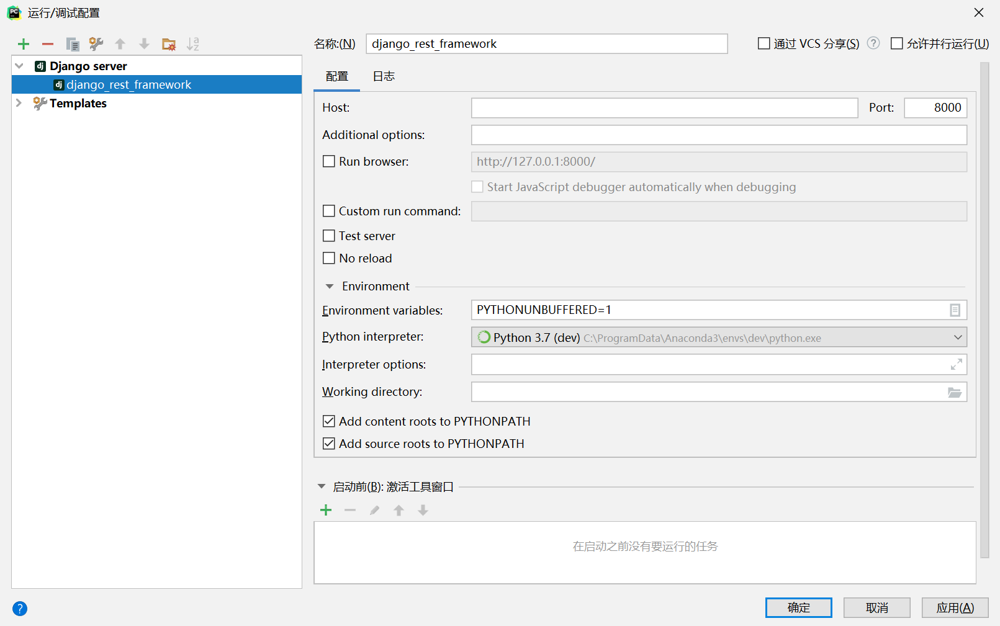
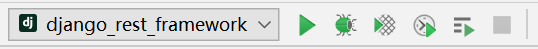
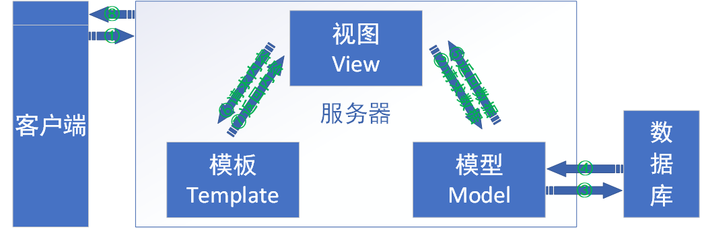

### 一、搭建Django环境

##### 1.安装Python环境

- 使用Anaconda安装虚拟环境

##### 2.安装Django环境

- 使用Anconda在对应虚拟环境中安装Django

##### 3.创建Django项目

- 使用PyCharm专业版新建Django项目

  - 新建项目>>选择Django>>Location填写项目名称>>Project Interpreter选择Existing interpreter（选择虚拟环境）>>Interpreter选择Anconda配置的虚拟环境 >>Application name填写应用名称>>勾选Enable Django admin>>点击Create创建项目。如图：

    

- 使用PyCharm社区版+命令行创建Django项目

  - 新建项目>>Pure Python>>Location填写项目名称>>Project Interpreter选择Existing interpreter（选择虚拟环境）>>Interpreter选择Anconda配置的虚拟环境 >>点击Create创建项目。如图：

    

  - 使用Terminal终端输入命令进行创建Django项目

    ```python
    django-admin startproject django_framework .
    ```

##### 4.Django项目结构介绍

- django_rest_framework项目名

- django_rest_framework二级目录与项目名相同，存放Django相关配置文件

- django_rest_framework/asgi.py是异步服务器相关配置(2.3.0新增模块)

- django_rest_framework/__init__.py包的标志性文件init

- django_rest_framework/settings.py存放Django全局配置信息

- django_rest_framework/urls.py存放全局路由表

- django_rest_framework/wsgi.py在部署Django项目时，使用wsgi服务器配置信息

- db.sqlite3是Django默认使用的sqlite文本数据库

- manage.py是Django提供的命令行操作工具，开发阶段使用它来启动项目和数据库的迁移等等

##### 5.运行Django项目

- 使用PyCharm运行按钮运行Django项目

  - 配置Django项目环境：文件>>设置>>语言&框架>>Django>>勾选Enable Django Support>>Django project root填写项目根目录>>Settings填写项目全局配置文件settings.py>>Manage script填写manage.py脚本管理文件>>点击确认配置

    

  - 配置Django运行脚本：点击Add Configurations>>添加配置>>Django Server>>名称填写项目名称>>Python interpreter选择对应Python虚拟环境>>点击确认

    

  - 点击运行按钮运行Django项目

    

- 使用命令行运行Django项目

  - 直接运行项目

    ```python
    python manage.py runserver
    ```

  - 指定IP和端口运行项目

    ```python
    #指定ip和端口，ip为当前服务器的地址
    python manage.py runserver 10.16.32.31:8888
    python manage.py runserver localhost：8888
    
    #指定端口
    python manage.py runserver 端口
    ```

- 停止运行Django项目

  - 直接关闭命令行窗口终止服务器
  - Terminal终端输入命令Ctrl+C终止服务器

##### 6.修改Django环境配置

- 设置语言和时区

  ```python
  # 编辑全局配置文件settings.py
  
  LANGUAGE_CODE = 'zh-hans'  # 设置语言为中文
  TIME_ZONE = 'Asia/Shanghai'  # 设置时区为亚洲/上海
  ```

- 取消Csr安全配置

  ```python
  MIDDLEWARE = [
      # 'django.middleware.csrf.CsrfViewMiddleware',
  ]
  ```

### 二、创建一个功能

##### 1.创建子应用

- 有两种方法实现创建应用

  - 使用PyCharm专业版，在创建工程时选择Django并输入子应用名称>>勾选Enable Django admin
- 使用命令行创建
  
```python
# name为子应用名称
python manage.py startapp name
```

##### 2.子应用意义

- 是Django最小的功能模块，会以应用的形式呈现
- 方便重用
- 结构更加清晰

##### 3.子应用结构

- django_views/migrations存放数据库迁移的相关信息
- django_views/__init__.py包的标志性文件init
- django_views/admin.py为admin站点的配置信息
- django_views/apps.py存放app的标签等相关信息
- django_views/models.py存放数据库模型相关信息
- django_views/tests.py存放当前应用的单元测试相关信息
- django_views/views.py主要定义相关功能（业务逻辑）

##### 4.全局配置文件中添加子应用信息

- 在settings.py全局配置文件中的INSTALLED_APPS列表中添加app的信息

  ```python
  # django_views为应用名称，DjangoViewsConfig首字母大写
  INSTALLED_APPS = [
      'django_views.apps.DjangoViewsConfig',
  ]
  ```

##### 5.编写子应用相关功能

- 在django_views/views.py中创建相关功能（函数视图或者类视图）

  ```python
  from django.http import HttpResponse
  
  # 函数视图
  def index(request):  
      return HttpResponse("<h1>可优村长你好啊！</h1>")
  ```
  
- 函数视图一定包含两个对象

  - request>>HttpRequest对象，用户请求相关的信息
  - HttpResponse>>响应字符串
  - 对于HttpRequest请求对象来说，是由django自动创建的，但是HttpResponse响应对象就必须我们自己创建。每个view请求处理方法必须返回一个HttpResponse响应对象。HttpResponse类需要在django.http.HttpResponse中导入。
  - 视图函数默认支持所有请求方法：get、post、put、delete等
  - 可以使用request.method来区分不同请求返回不同内容
  
  ```python
  from django.http import HttpResponse
  from django.views import View
  
  # 类视图,同时需要导入View
  class HomeIndex(View):
      def get(self,request):
          return HttpResponse("<h1>可优村长你好啊！</h1>")
  ```
  
- 类视图的优点:

  - 代码可读性好

  - 类视图相对于函数视图有更高的复用性,如果其他地方需要使用到某个类的某个特定方法,直接继承该类的视图就可以了

  - 实例方法get、post、put、delete全部小写与相应的请求方法一一对应

  - get实例方法第一个参数为当前类视图的对象，第二个参数为HttpRequest请求对象
  
  - 每个实例方法必须返回HttpResponse对象或者HttpResponse子类对象
  
  - 定义类视图需要继承自的Django提供的父类的View或者View子类
  
    ```python
    from django.views import View
    ```
  
- render函数的第一个参数为HttpRequest对象，第二个参数为静态文件模板，第三个参数locals()当前实例方法的本地变量
  类方法

    - return HttpResponse("<h1>可优村长你好啊！这个是GET方法请求的结果</h1>")
    - 从数据库中读取了项目相关的数据
    - 所有的业务逻辑，都会在后端视图中来定义
    - Java中的MVC就相当于Django中的MVT
      - 当前data类似于M--模型Model
      - 当前T类似于模板--Template
      - 当前V相当于视图--View

##### 6.路由表中添加路由信息

-   全局路由和子路由的作用：

    -   使views里面处理数据的函数与请求的**url**建立映射关系。
    -   发起请求后，根据**urls.py**里的关系条目，去查找与请求对应的处理方法，从而返回给客户端。

-   路由匹配规则：

    -   发起请求后，使用请求路径去匹配**urls.py**中**urlpatterns**列表的值，**urlpatterns**为固定名称的列表

    -   **urlpatterns**列表中的元素分别代表一条路由信息

        -   第一个参数index/代表的是请求路径
        -   第二个参数index为子应用中views模块的视图名称

        ```python
        urlpatterns = [
            path('admin/', admin.site.urls),
            path('index/', index),
        ]
        ```

    -   函数视图、类视图和子路由可以作为**urlpatterns**的元素，

           - 函数视图作为元素：直接使用函数名作为path的第二个参数

          ```python
        path('index/', index)
          ```

           - 类视图作为元素：使用**类方法名.as_view()**作为path的第二个参数

          ``` python
        path('index/', HomeIndex.as_view())
          ```

           - 子路由作为元素：如果path函数的第二个参数为**include**，则进入**include**的参数对应元素的子路由中进行匹配，子路由匹配规则与全局路由相同
                - 需要导入django.urls中的include模块
             - django_views/为子应用目录，include参数为**'子应用名称.urls'**的字符串

          ```python
        from django.urls import include
        path('django_views/',include('django_views.urls'))
          ```

     - 全局路由和子路由在客户端访问时，全局路由可直接访问对应路径子应用的函数视图或者类视图，子路由需要先访问子应用目录后访问对应路径子应用的函数视图或类视图

     -   从往下匹配与请求路径对应的元素

          -   元素中包含请求路径的关键字，即匹配上，**Django**会自动调用**path**函数的第二个参数指定的视图（函数视图或者类视图）并停止匹配
          -   元素中不包含请求路径的关键字，即未匹配上，则抛出404异常（默认返回为404页面，状态码为404）

- 全局路由表django_rest_framework/urls.py中添加路由信息，即urlpatterns添加元素。
  
  *简意：一步到位*
  
     ```python
  from django.contrib import admin
  from django.urls import path, include
  
  # from django_views.views import index
  # from django_views.views import HomeIndex
  
  urlpatterns = [
      path('admin/', admin.site.urls),
      # 函数视图的全局路由配置
      # path('index/', index),
  
      # 类视图的全局路由配置
      #  path('index/', HomeIndex.as_view()),
  
      # 子路由的全局路由配置
      path('django_views/', include('django_views.urls')),
  ]
     ```
  
   - 具体方法见“路由匹配规则”C中的类视图作为元素
   - 在全局路由中添加子路由信息     #先匹配全局路由，匹配上后进入子路由再次匹配具体路由信息
     - 在django_views中创建urls.py路由文件
       - 在django_views/urls.py配置路由信息   #需导入子应用views.py模块的视图名称，from .views import HomeIndex 具体规则与全局路由一致
     - 在全局路由中添加子路由元素参数include

### 三、MVT模式和两种开发模式

##### 1、[MVT]()模式



- 介绍
  - M全拼为Model，与MVC中的M功能相同，负责和数据库交互，进行数据处理
  - V全拼为View，与MVC中的C功能相同，接收请求，进行业务处理，返回响应
  - T全拼为Template，与MVC中的V功能相同，负责构造要返回的HTML页面

##### 2、两种开发模式

- 前后台不分离：后端控制数据的展示，前端与后端的耦合度很高，返回的是HTML页面，实用性、拓展性差，只能用于浏览器，其他终端不适配。
- 前后端分离：后端仅返回前端所需要的数据，不再控制前端的展示效果。前端的展示效果全由前端负责，前后端完全独立，耦合度相对较低。
      前后端可同时开发，缩小业务上线周期。
  · 适用性、拓展性非常好
  · 适合多终端运行同一套接口（PC、APP、小程序等）

### 四、

### 五、